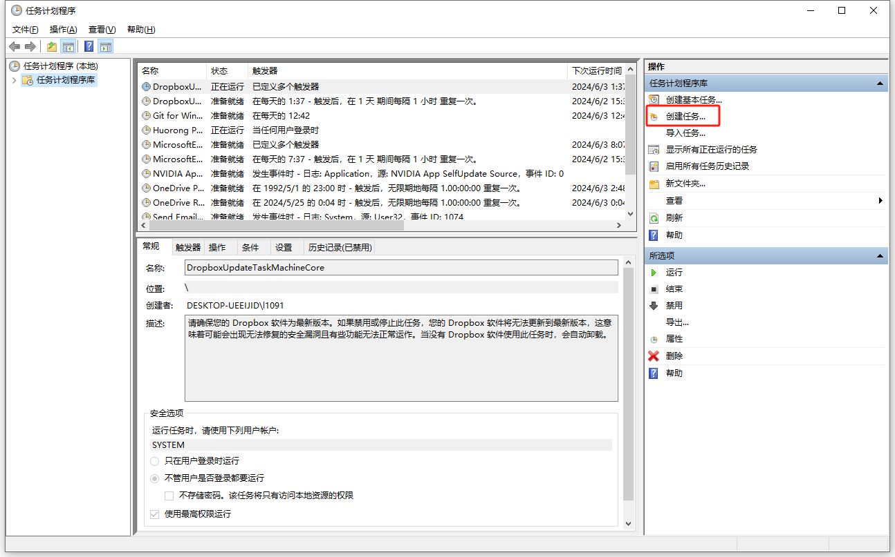
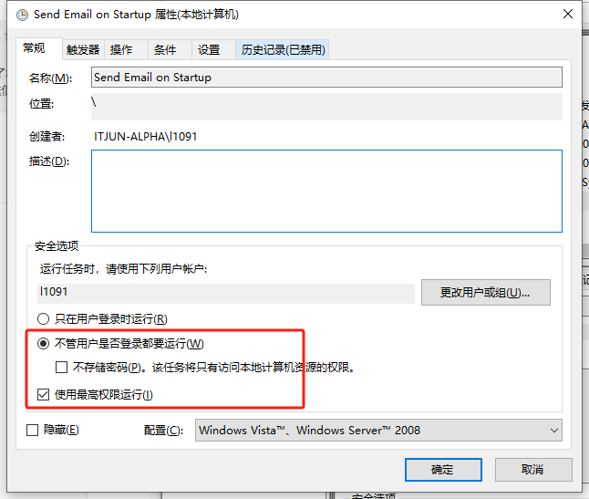
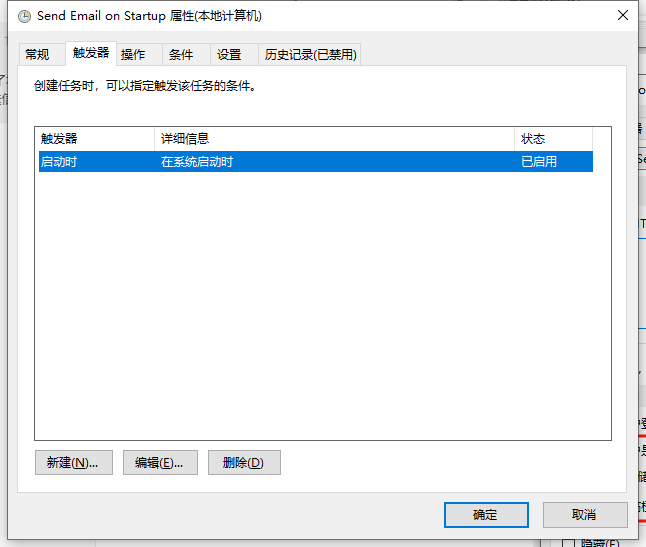
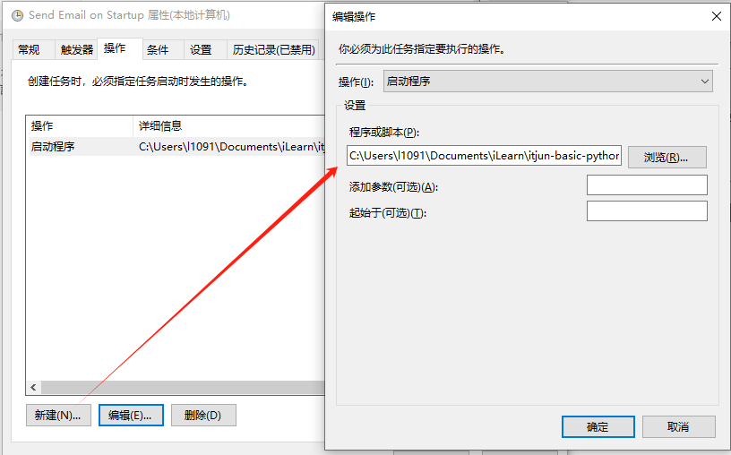
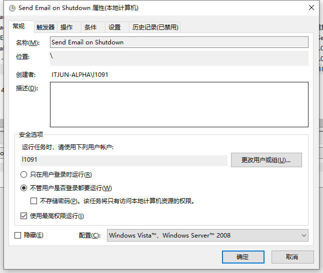
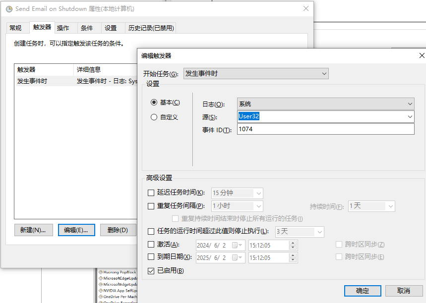
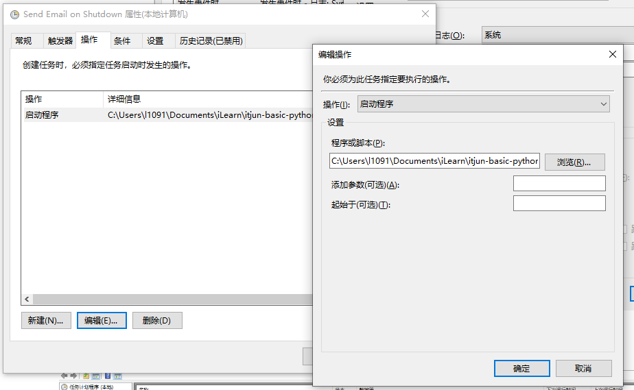
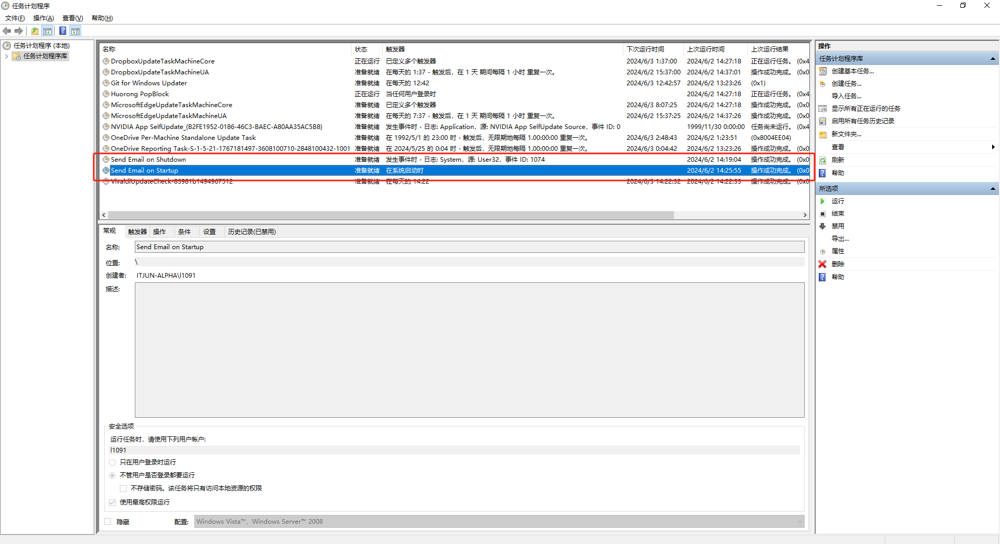

# Python Email

本示例展示了在系统开关机的时候，使用 Python 发送信息到 139 邮箱。

## 注意事项

1. 发送端使用 阿里云企业邮箱 容易丢件，经常发送失败
2. 使用 139邮箱 SMTP 发送邮件，提示 SSL 连接失败不稳定
3. 使用 QQ 邮箱 SMTP 发送邮件，目前已知是最稳定的
4. 使用 139邮箱作为接收方可以依赖移动邮件短信通知更及时的收到消息，因此手机可以少安装一个 139邮箱客户端

## 配置Windows任务计划程序

#### 创建批处理文件

创建两个批处理文件，一个用于开机通知，一个用于关机通知。

##### startup.bat

```batch
python "C:\Users\l1091\Documents\iLearn\itjun-basic-python\startup\send_email.py" startup
```

##### shutdown.bat

```batch
python "C:\Users\l1091\Documents\iLearn\itjun-basic-python\startup\send_email.py" shutdown
```

#### 配置开机任务

1. 打开任务计划程序（Task Scheduler）。
2. 选择“创建任务”（Create Task）。
3. 在“常规”选项卡，给任务命名，例如“Send Email on Startup”。
4. 在“触发器”选项卡，点击“新建”（New），选择“在系统启动时”（At startup）。
5. 在“操作”选项卡，点击“新建”（New），操作类型选择“启动程序”（Start a program）。
6. 浏览到 startup.bat 文件并选择。
7. 保存任务。









#### 配置关机任务

1. 打开任务计划程序（Task Scheduler）。
2. 选择“创建任务”（Create Task）。
3. 在“常规”选项卡，给任务命名，例如“Send Email on Shutdown”。
4. 在“触发器”选项卡，点击“新建”（New），选择“在系统关闭时”（On an event），并选择以下设置：
    - 日志：系统
    - 源：用户32
    - 事件ID：1074
5. 在“操作”选项卡，点击“新建”（New），操作类型选择“启动程序”（Start a program）。
6. 浏览到 shutdown.bat 文件并选择。
7. 保存任务。







#### 任务配置结果预览


